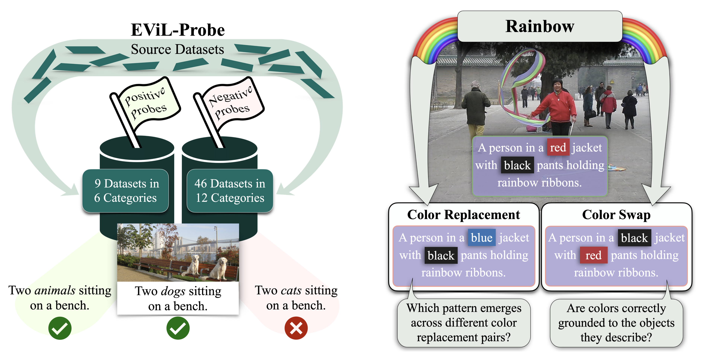

# Visio-Linguistic Probing

This repository contains the Rainbow (to appear at EACL 2024) and EViL-Probe (to appear at LREC-COLING 2024) visio-linguistic probing benchmarks.
It provides the code to derive these benchmarks from the existing datasets they base on.



## Preparation
Before you can compile the benchmarks, the required source datasets have to be placed into the respective directories as detailed below:

| subdir of ```source_datasets```       | source dataset files           | corresponding images found here (place in subdir of ```images```) |
| ------------- |-------------| -----|
| ```/ARO```   | from [ARO](https://github.com/mertyg/vision-language-models-are-bows/blob/main/README.md): ```visual_genome_attribution.json``` (generated using VG_Attribution(image_preprocess=preprocess, download=True, root_dir=root_dir), as described in the repo) and ```visual_genome_relation.json``` (generated using VG_Relation(image_preprocess=preprocess, download=True, root_dir=root_dir, as described in the repo ) | uses [VisualGenome](https://homes.cs.washington.edu/~ranjay/visualgenome/api.html) images that are downloaded when files are created, place image files in ```/ARO``` |
| ```/Compositional-Visual-Genome```  | [ComVG.csv](https://github.com/eric-ai-lab/ComCLIP/blob/main/datasets/ComVG.csv) | uses [VisualGenome](https://homes.cs.washington.edu/~ranjay/visualgenome/api.html) images, place image files in ```/VisualGenome``` |
| ```/Counting-Probe``` | git clone [Counting Probe](https://github.com/Heidelberg-NLP/counting-probe) | [linked](http://vision.stanford.edu/yukezhu/visual7w_images.zip) in the Counting Probe repo, place image files in ```/visual7w``` |
| ```/EqBen``` | [this file](https://drive.google.com/file/d/1-CWEuZ5F0KQ4d94Y9rRtBsMIcqb8V7nm/view) linked in the [EqBen Repository](https://github.com/Wangt-CN/EqBen?tab=readme-ov-file#eqben-1) | [linked](https://drive.google.com/file/d/1e608uhd36ak_v7SnlMVaYcekBc4gBqzn/view?usp=drive_link) in the EqBen repo, place subdirs in ```/EqBen```|
| ```/Flickr30k``` | ```dataset_flickr30k.json``` as linked [here](http://cs.stanford.edu/people/karpathy/deepimagesent/caption_datasets.zip) by [this](https://github.com/jiasenlu/NeuralBabyTalk/blob/master/data/README.md) repository | sign up [here](https://forms.illinois.edu/sec/229675), place image files in ```/Flickr30k```|
| ```/FOIL-IT``` | ```foilv1.0_test_2017.json``` as linked [here](https://www.dropbox.com/s/u4ntgo73szg6yai/foilv1.0_test_2017.json) from the [FOIL-IT page](https://foilunitn.github.io)| uses [MS COCO](https://cocodataset.org/#download) images, place subdirs in ```/MS_COCO```|
| ```/High-level``` | ```test.jsonl``` from [here](https://github.com/michelecafagna26/HL-dataset/tree/main/annotations) | uses [MS COCO](https://cocodataset.org/#download) images they link [here](https://huggingface.co/datasets/michelecafagna26/hl/resolve/main/data/images.tar.gz), place subdirs in ```/MS_COCO```|
| ```/MS_COCO``` | ```dataset_coco.json``` as linked [here](http://cs.stanford.edu/people/karpathy/deepimagesent/caption_datasets.zip) by [this](https://github.com/jiasenlu/NeuralBabyTalk/blob/master/data/README.md) repository | [here](https://cocodataset.org/#download), place subdirs in ```/MS_COCO```
| ```/Predicate-Noun``` | [eval_set.json](https://github.com/mitjanikolaus/multimodal-predicate-noun-dependencies/blob/main/data/sentence-semantics/eval_set.json) | uses images from [OpenImages](https://storage.googleapis.com/openimages/web/index.html), place image files in ```/OpenImages```|
| ```/SVO-Probes```| [svo_probes.csv](https://github.com/google-deepmind/svo_probes/blob/main/svo_probes.csv) | image urls are linked in [svo_probes.csv](https://github.com/google-deepmind/svo_probes/blob/main/svo_probes.csv), uncomment line 180 of ```evil-probe/prepare_SVO_probes.py``` to download, place image files in ```/SVO_Probes```|
| ```/VALSE```| all of [these](https://github.com/Heidelberg-NLP/VALSE/tree/main/data) files | uses images from [SWiG](https://github.com/allenai/swig?tab=readme-ov-file) (place image files in ```/SWiG```), [VisualDialog](https://visualdialog.org/data) (place validation images in ```/VisualDialog/val2018```), [MS COCO](https://cocodataset.org/#download) (place subdirs in ```/MS_COCO```), [visual7w](http://ai.stanford.edu/~yukez/visual7w/) (place image files in ```visual7w```), |
| ```/Visual-Spatial-Reasoning```| [all_vsr_validated_data.jsonl](https://github.com/cambridgeltl/visual-spatial-reasoning/blob/master/data/data_files/all_vsr_validated_data.jsonl) | uses [MS COCO](https://cocodataset.org/#download) images, place subdirs in ```/MS_COCO```|
| ```/VL-Checklist```| [these](https://github.com/om-ai-lab/VL-CheckList/tree/main/data) subdirs | overview [here](https://github.com/om-ai-lab/VL-CheckList/blob/main/DATASETS.md): uses [VisualGenome](https://homes.cs.washington.edu/~ranjay/visualgenome/api.html) (place image files in ```/VisualGenome```), [OpenImages](https://storage.googleapis.com/openimages/web/index.html) (place image files in ```/OpenImages```) and [SWiG](https://github.com/allenai/swig?tab=readme-ov-file) (place image files in ```/SWiG```)|
| ```/Why-Winoground-Hard```| ```examples_augmented.jsonl``` as generated per the instructions in [this](https://github.com/ajd12342/why-winoground-hard/tree/main) repository | [here](https://huggingface.co/datasets/facebook/winoground/tree/main/data), place image files in ```/Winoground```|
| ```/Winoground```| [examples.jsonl](https://huggingface.co/datasets/facebook/winoground/blob/main/data/examples.jsonl) | [here](https://huggingface.co/datasets/facebook/winoground/tree/main/data), place image files in ```/Winoground```|
  

## EViL-Probe
To compile EViL-Probe:
- Place the source datasets in the subdirectories of ```source_datasets``` as detailed in the above table.
- Execute ```bash evil-probe/build_benchmark.sh```. (If you only wish to compile part of the benchmark, uncomment the respective line(s) in the script.) Files will be written to ```evil-probe/benchmark```.

All ```*.jsonl``` files in the benchmark have the same structure. This is what an exemplary entry looks like:
```json
{"example_id": "example_770337_253737",
"img_id": "COCO_val2014_000000391895.jpg",
"img_ds": "MS_COCO/val2014",
"sent_1": "A man with a red helmet on a small moped on a dirt road. ",
"sent_1_label": true,
"sent_2": "Two parking meter's with one covered and has graffiti on it.",
"sent_2_label": false,
"sent_ds": "MS_COCO",
 "ds_aspect": "random"}
```


## Rainbow
Rainbow builds on EViL-Probe.
To compile Rainbow, make sure you have compiled EViL-Probe and then run ```python3 rainbow/extract_color_data.py```.
Files will be written to ```rainbow/benchmark```.

We annotated the Flickr30k examples with the color hues that are mentioned in the image descriptions. These can be found in ```rainbow/Flickr_30k_hex_codes.csv```.

All ```*.jsonl``` files in the benchmark have the same structure. This is what an exemplary entry looks like:
```json
{"example_id": "0_matrix_white_brown",
"img_ds": "MS_COCO/val2014",
"img_id": "COCO_val2014_000000033672.jpg",
"sent_1": "A girl in is riding a white horse on a sunny day .",
"sent_2": "A girl in is riding a brown horse on a sunny day .",
"sent_1_label": true,
"sent_2_label": false,
"ds_aspect": "color_white_brown",
"sent_ds": ["coco_random.jsonl"],
"sent_1_color": "white",
"sent_2_color": "brown"}
```

## Citations
EViL-Probe
```
@inproceedings{evil-probe-2024,
    title = "EVil-Probe - A Composite Benchmark for Extensive Visio-Linguistic Probing",
    author = "Bexte, Marie  and
      Horbach, Andrea  and
      Zesch, Torsten",
    booktitle = "Proceedings of LREC-COLING",
    year = "2024",
}
```

Rainbow
```
@inproceedings{rainbow-2024,
    title = "Rainbow - A Benchmark for Systematic Testing of How Sensitive Visio-Linguistic Models are to Color Naming",
    author = "Bexte, Marie  and
      Horbach, Andrea  and
      Zesch, Torsten",
    booktitle = "Proceedings of the 18th Conference of the European Chapter of the Association for Computational Linguistics",
    year = "2024",
}
```
